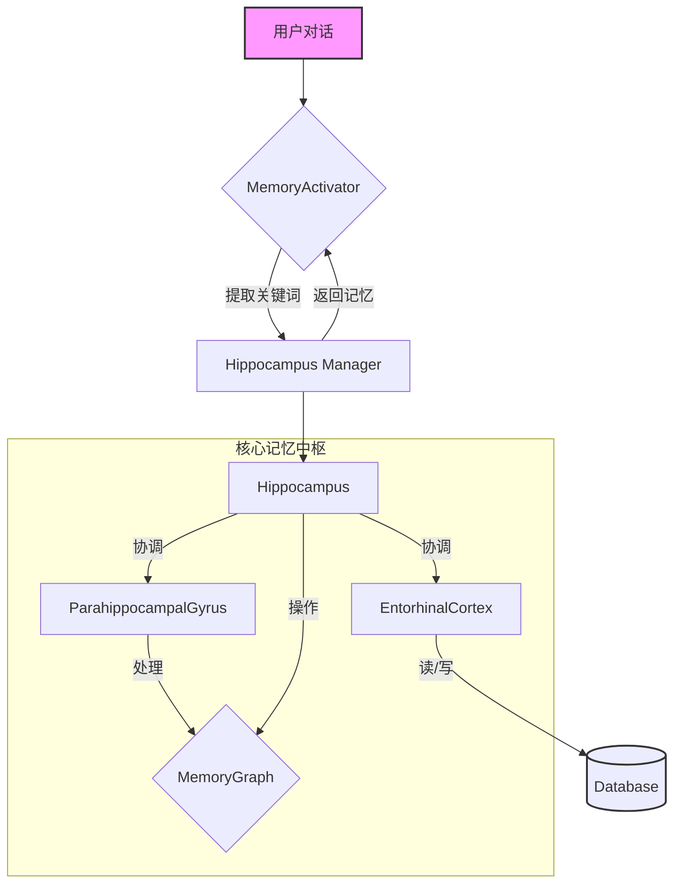
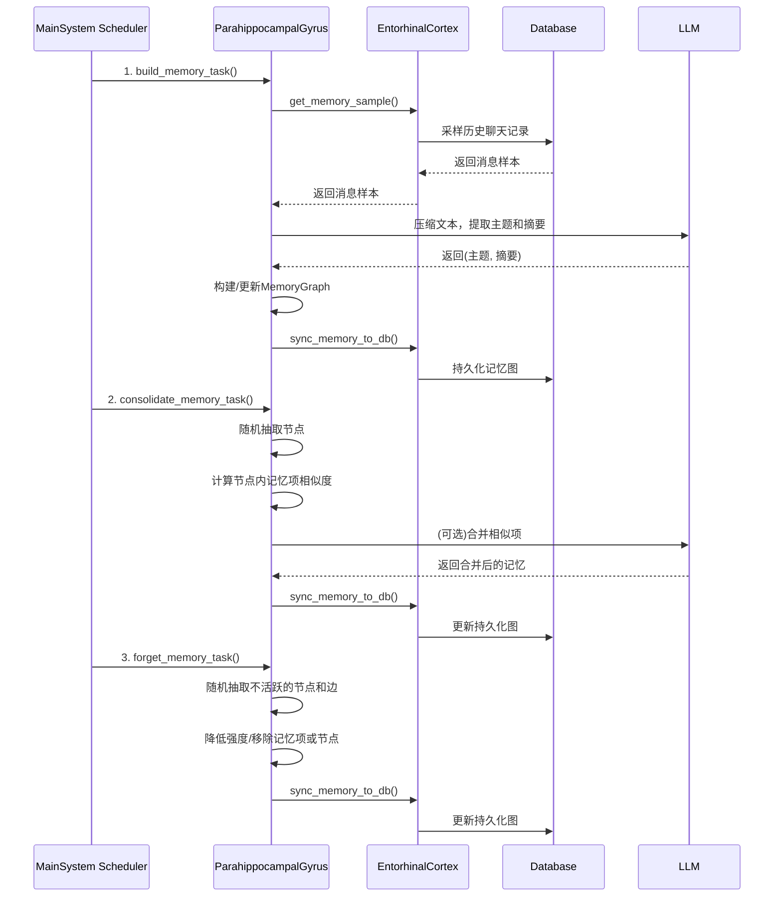
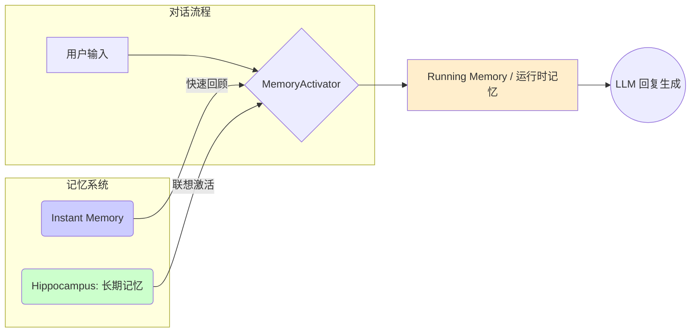

# Memory System 原理深度解析

本文档旨在深入解析 `memory_system` 的核心设计、工作流程及其主要组件。该系统通过模拟人脑海马体的功能，实现了一套复杂而智能的记忆管理机制。

## 一、 核心架构：模拟海马体

系统的整体架构围绕 `Hippocampus` 类构建，模拟了人脑中负责学习和记忆的关键区域。



**代码示例: `MemoryGraph` 的基本操作**
```python
# from src/chat/memory_system/Hippocampus.py

# 创建一个记忆图实例
memory_graph = MemoryGraph()

# 添加两个概念（节点）和它们相关的记忆
memory_graph.add_dot("工作", "今天和同事讨论了Q3的KPI。")
memory_graph.add_dot("同事A", "同事A对项目计划提出了很好的建议。")

# 将两个概念连接起来
memory_graph.connect_dot("工作", "同事A")

# 边的强度会因为重复连接而增加
memory_graph.connect_dot("工作", "同事A")
# "工作" 和 "同事A" 之间的 strength 现在是 2
```

- **`Hippocampus`**: 系统的中枢，负责协调所有记忆相关的操作。
- **`MemoryGraph`**: 记忆的载体，一个由概念（节点）和关系（边）组成的知识图谱。
- **`EntorhinalCortex`**: “内嗅皮层”，负责记忆系统与数据库之间的信息交换，是记忆的“输入/输出端口”。
- **`ParahippocampalGyrus`**: “海马旁回”，负责高级记忆处理，如新记忆的构建、旧记忆的遗忘和相似记忆的整合。
- **`HippocampusManager`**: 全局单例，确保系统只有一个记忆中枢实例。
- **`MemoryActivator`**: 记忆激活器，负责从当前对话中提取线索，并从 `Hippocampus` 中检索相关记忆。

---

## 二、 记忆的生命周期

记忆在系统中经历一个完整的、动态的生命周期，由三个核心的后台任务驱动。



1.  **构建 (Build)**: 系统定期从数据库中采样过去的对话，利用LLM将其压缩成“主题-摘要”形式的记忆节点，并建立节点间的关联，形成知识图谱。
2.  **整合 (Consolidate)**: 系统会定期检查节点内部，将内容相似的记忆项进行合并，保留信息量更大的一条，从而达到记忆精简的目的。
3.  **遗忘 (Forget)**: 对于长时间不活跃（未被访问或加强）的记忆节点和连接，系统会逐渐降低其“强度”，最终将其从图谱中移除，模拟人脑的遗忘过程，防止信息过载。

---

## 三、 记忆的类型与激活

系统包含多种类型的记忆，以适应不同的对话场景。



**代码示例: 记忆激活与扩散**
```python
# from src/chat/memory_system/memory_activator.py
class MemoryActivator:
    async def activate_memory_with_chat_history(self, target_message, chat_history_prompt):
        # ... 使用LLM从对话中提取关键词 ...
        prompt = await global_prompt_manager.format_prompt(
            "memory_activator_prompt",
            # ...
        )
        response, _ = await self.key_words_model.generate_response_async(prompt)
        keywords = list(get_keywords_from_json(response))

        # 调用记忆系统，传入关键词进行扩散激活
        related_memory = await hippocampus_manager.get_memory_from_topic(
            valid_keywords=keywords, max_memory_num=3, max_memory_length=2, max_depth=3
        )
        # ... 处理返回的记忆 ...
        return self.running_memory

# from src/chat/memory_system/Hippocampus.py
class Hippocampus:
    async def get_memory_from_topic(self, keywords: list[str], ...):
        # ...
        # 对每个关键词进行扩散式检索
        for keyword in valid_keywords:
            # ... 初始化激活值 ...
            nodes_to_process = [(keyword, 1.0, 0)]

            while nodes_to_process:
                current_node, current_activation, current_depth = nodes_to_process.pop(0)
                
                if current_activation <= 0 or current_depth >= max_depth:
                    continue

                # 核心扩散逻辑
                for neighbor in self.memory_graph.G.neighbors(current_node):
                    strength = self.memory_graph.G[current_node][neighbor].get("strength", 1)
                    new_activation = current_activation - (1 / strength) # 强度越高，衰减越小
                    
                    if new_activation > 0:
                        # ... 记录新激活值，并将邻居加入队列 ...
                        nodes_to_process.append((neighbor, new_activation, current_depth + 1))
        # ...
        # 根据最终的累加激活值选择节点并返回记忆
```

- **长期记忆 (Long-term Memory)**: 由 `Hippocampus` 管理的核心知识图谱，持久、复杂且不断演化。
- **即时记忆 (Instant Memory)**: 一个轻量级的“临时笔记”，用于快速记录和回顾当前对话中的关键信息。
- **运行时记忆 (Running Memory)**: 存在于内存中的短期记忆池，存放着当前对话中被激活的记忆项，直接服务于回复生成。

**激活过程 - 扩散激活 (Spreading Activation)**:

当用户输入新消息时：
1.  `MemoryActivator` 利用LLM从对话中提取**关键词**。
2.  这些关键词作为起始点，在 `MemoryGraph` 中被“激活”。
3.  激活能量会像涟漪一样，沿着图的边扩散到相邻的节点。连接越**紧密**（边的`strength`越高），能量衰减越**慢**。
4.  经过几轮扩散后，系统会选出那些累积激活能量最高的节点。
5.  从这些高亮节点中提取出的记忆，就构成了与当前话题最相关的“联想内容”，被放入`Running Memory`，供LLM在生成回复时参考。

---

## 四、 设计的优缺点

### 优点

- **认知模拟**: 高度模拟人脑的联想记忆和新陈代谢，使系统行为更“智能”。
- **知识演化**: 能够通过持续学习，自动发现概念间的隐藏关系，实现知识的涌现。
- **联想能力**: 扩散激活算法带来了强大的联想检索能力，能提供更有深度的对话背景。
- **高度可配**: 提供了丰富的配置项，允许对记忆行为进行精细调整。
- **鲁棒性**: 遗忘和整合机制保障了系统的长期健康，避免信息冗余。

### 缺点

- **成本高昂**: 严重依赖LLM和复杂的图计算，带来了较高的计算和API成本。
- **黑盒问题**: 记忆节点的质量依赖LLM的理解，过程不可控，可能产生错误记忆。
- **冷启动慢**: 系统需要大量数据进行“喂养”，才能发挥作用。
- **参数敏感**: 系统表现对各种参数非常敏感，调试和优化成本高。
- **维护复杂**: 整体逻辑复杂，对二次开发和维护有较高要求。

## 五、 总结

`memory_system` 是一个富有创造力的设计，它超越了传统的数据库问答，试图在代码层面实现一个能够学习、联想和遗忘的“活”的记忆大脑。虽然实现复杂且成本高昂，但它为构建真正具有长期记忆和深度思考能力的AI助手提供了一个极具价值的范例。

---

### 附录：记忆检索流程详解 (`get_memory_from_text`)

从一段文本中联想到相关的记忆，是整个系统的核心功能之一。这个过程主要由 `get_memory_from_text` 函数实现，其内部逻辑可以分解为以下几个关键步骤：

#### 步骤一：关键词提取 (Keyword Extraction)

这是流程的入口。系统首先需要从输入的文本中找出核心线索（关键词）。

-   **精准模式 (默认)**: 调用LLM来理解上下文并总结出最关键的概念。这确保了关键词的质量和相关性。
    ```python
    # from src/chat/memory_system/Hippocampus.py:342
    # 调用 self.find_topic_llm(text, topic_num) 生成Prompt
    prompt = f"这是一段文字：\n{text}\n\n请你从这段话中总结出最多{topic_num}个关键的概念..."
    topics_response, _ = await self.model_summary.generate_response_async(prompt)
    keywords = re.findall(r"&lt;([^&gt;]+)&gt;", topics_response)
    ```
-   **快速模式**: 使用 `jieba` 分词，速度快但不保证准确性。

#### 步骤二：关键词验证 (Keyword Validation)

提取出的关键词不一定都存在于记忆图谱中。系统会进行一次过滤，只保留那些在图谱中已存在的关键词作为后续联想的起点。

```python
# from src/chat/memory_system/Hippocampus.py:363
valid_keywords = [keyword for keyword in keywords if keyword in self.memory_graph.G]
```

#### 步骤三：扩散激活 (Spreading Activation)

这是最核心的联想步骤，模拟了大脑的联想过程。

1.  **能量赋予**: 每个验证后的关键词（图节点）被赋予 `1.0` 的初始“激活能量”。
2.  **能量扩散**: 能量会沿着图的边（关系）扩散到相邻的节点。
3.  **能量衰减**: 每经过一条边，能量会根据边的 `strength`（连接强度）进行衰减。连接越强，衰减越慢。
    ```python
    # from src/chat/memory_system/Hippocampus.py:373-419 (Simplified)
    # new_activation = current_activation - (1 / strength)
    ```
4.  **能量累加**: 一个节点可能从多个路径接收到能量，所有能量会累加，形成该节点的最终激活值。

#### 步骤四：高相关性节点选择

系统通过一种“激活值平方的归一化”策略，放大高激活值节点被选中的概率，然后选出最相关的 `max_memory_num` 个节点。

#### 步骤五：记忆提取、筛选与返回

1.  **提取**: 从上一步选出的高相关性节点中，提取出所有具体的记忆文本 (`memory_items`)。
2.  **筛选**: 计算每一条记忆文本与原始输入文本的“余弦相似度”，保留最相似的几条。
3.  **去重与返回**: 对所有筛选出的记忆进行最后一次去重，然后以 `(主题, 具体记忆)` 的格式返回。

这个精巧的流程确保了系统不仅能找到直接相关的记忆，更能通过模拟联想，挖掘出深层次的、间接相关的知识。

---

### 附录二：记忆图谱的“增强”机制

在 `memory_system` 中，“增强”（Strengthening）并非一个独立的操作，而是贯穿于记忆构建与使用过程中的核心机制，主要指**概念之间连接的加固**。一个更强的连接意味着更紧密的关联，这直接影响着联想（扩散激活）的深度和广度。

增强主要通过以下两种方式实现：

#### 1. 构建时增强 (Strengthening during Memory Formation)

这是在系统学习新知识时最主要的增强方式，发生在 `operation_build_memory` 函数中。

-   **基于语义相似性**: 当系统从对话中提取出一个新主题时，会计算它与图谱中所有旧主题的文本相似度。如果发现一个高度相似的旧主题（例如，新主题“Q3的KPI”与旧主题“工作汇报”），系统会为它们建立一条连接，其初始强度 `strength` 与它们的相似度成正比。
    ```python
    # from src/chat/memory_system/Hippocampus.py:1295
    similarity = cosine_similarity(v1, v2)
    if similarity >= 0.7:
        # strength 与相似度挂钩
        strength = int(similarity * 10)
        self.memory_graph.G.add_edge(topic, similar_topic, strength=strength, ...)
    ```

-   **基于共现关系**: 系统默认从**同一段**对话中提取出的所有新主题之间存在强关联。因此，它会将这些主题两两配对，并为它们建立或加强连接。
    ```python
    # from src/chat/memory_system/Hippocampus.py:1365
    for topic1, topic2 in combinations(all_topics, 2):
        self.memory_graph.connect_dot(topic1, topic2)
    ```

#### 2. 重复中增强 (Strengthening through Repetition)

这种方式模拟了人脑“重复是记忆之母”的原理，体现在 `connect_dot` 方法的内部逻辑中。

-   **原理**: 每当 `connect_dot` 被调用来连接两个概念时，它会检查这两个概念之间是否已经存在连接。
    -   如果**不存在**，则创建一条强度为 `1` 的新连接。
    -   如果**已存在**，则直接将该连接的 `strength` 属性 `+1`。
    ```python
    # from src/chat/memory_system/Hippocampus.py:70
    if self.G.has_edge(concept1, concept2):
        self.G[concept1][concept2]["strength"] = self.G[concept1][concept2].get("strength", 1) + 1
    else:
        self.G.add_edge(concept1, concept2, strength=1, ...)
    ```
这意味着，两个概念被系统共同提及或关联的次数越多，它们之间的连接就越强固。

#### “增强”的作用

连接的 `strength` 直接决定了“扩散激活”时能量的衰减速度 (`new_activation = current_activation - (1 / strength)`)。一个高强度的连接能让联想的能量传递得更深、更远，从而在对话中挖掘出更多相关但间接的记忆，使交流更具深度和上下文感知能力。
# 记忆模块完整工作流程

当用户发送一条消息后，整个记忆模块的完整工作流程。

这个流程主要分为两个大的阶段：
**阶段一：记忆提取与激活（为生成回复做准备）**
**阶段二：记忆形成与巩固（在对话后学习）**

---

### **阶段一：记忆提取与激活 (Memory Retrieval & Activation)**

这个阶段的目标是为即将生成的回复，从长期记忆中找到最相关的上下文。核心是 `MemoryActivator` 和 `Hippocampus`。

**1. 触发点: `DefaultReplyGenerator`**
   - 当用户消息进入回复生成流程时，`DefaultReplyGenerator` 会被实例化。
   - 在其内部，它会创建一个 `MemoryActivator` 的实例：`self.memory_activator = MemoryActivator()`。
   - 接着，它会调用 `MemoryActivator` 的核心方法来获取记忆上下文。

**2. 调用 `MemoryActivator.activate_memory_with_chat_history(target_message, chat_history_prompt)`**
   - **目的**: 激活并返回一个短期相关的记忆列表 (`running_memory`)。
   - **内部实现**:
     a. **检查总开关**: 首先检查 `global_config.memory.enable_memory` 是否为 `True`，如果不是，直接返回空列表 `[]`，流程结束。
     b. **准备关键词提取Prompt**: 调用 `global_prompt_manager.format_prompt(\"memory_activator_prompt\", ...)`，将当前的聊天记录 (`chat_history_prompt`)、用户的目标消息 (`target_message`) 以及历史缓存的关键词 (`self.cached_keywords`) 填充到一个预设的模板中。这个Prompt要求LLM根据上下文总结出新的、不重复的关键词。
     c. **调用LLM提取关键词**: 执行 `await self.key_words_model.generate_response_async(prompt)`，这是一个小模型调用，专门用于快速提取关键词。返回的是一个包含关键词的JSON字符串。
     d. **解析关键词**: 调用 `get_keywords_from_json(response)`。此函数内部使用 `json_repair` 修复可能格式错误的JSON，然后用 `json.loads` 解析，并返回 `keywords` 列表。
     e. **更新关键词缓存**: 将新获取的 `keywords` 添加到 `self.cached_keywords` (一个 `set` 结构，自动去重)。为了防止缓存无限膨胀，如果缓存大小超过10，会移除最早的几个，保留最近的8个。
     f. **调用长期记忆系统**: 这是关键的一步，调用 `await hippocampus_manager.get_memory_from_topic(...)`，将提取到的有效关键词 (`keywords`) 传递给海马体管理器，请求从长期记忆中检索信息。

**3. 调用 `HippocampusManager.get_memory_from_topic(valid_keywords, ...)`**
   - **目的**: 这是对外的接口，它会直接调用内部 `Hippocampus` 实例的同名方法。
   - **内部实现**: `return await self._hippocampus.get_memory_from_topic(...)`

**4. 调用 `Hippocampus.get_memory_from_topic(keywords, ...)`**
   - **目的**: 根据关键词，在记忆图谱中进行扩散式检索，找到最相关的记忆节点和内容。
   - **内部实现**:
     a. **过滤无效关键词**: 遍历传入的 `keywords`，只保留那些在记忆图 `self.memory_graph.G` 中真实存在的节点，得到 `valid_keywords`。
     b. **激活值扩散 (核心算法)**: 遍历每一个 `valid_keyword`：
        i.  以当前关键词为起点，激活值设为 `1.0`。
        ii. 开始广度优先的遍历，探索邻近节点，直到达到 `max_depth`。
        iii. 每经过一条边，激活值会衰减，衰减量是 `1 / strength`，其中 `strength` 是边的权重。**关联越强的边，衰减越慢**。
        iv. 将所有从不同关键词扩散得到的激活值累加到 `activate_map` 中，得到每个相关节点的总激活值。
     c. **选择候选节点**: 对 `activate_map` 中的激活值进行 **平方和归一化**，这会放大高激活值节点被选中的概率。然后根据归一化后的概率，选出最多 `max_memory_num` 个节点作为候选记忆节点，存入 `remember_map`。
     d. **提取并筛选记忆内容**: 遍历 `remember_map` 中的每个候选节点：
        i.  获取该节点下存储的所有记忆项 `memory_items`。
        ii. 计算每一条记忆项与传入的 `keywords` 的 **余弦相似度**。
        iii. 根据相似度排序，选出最相似的 `max_memory_length` 条记忆。
     e. **去重与格式化**: 将所有候选节点中提取出的记忆进行内容去重，并格式化为 `(topic, memory)` 的元组列表返回。

**5. 回到 `MemoryActivator.activate_memory_with_chat_history`**
   - **目的**: 管理短期运行记忆，并返回最终结果。
   - **内部实现**:
     a. **更新 `running_memory`**: 在添加新记忆前，先遍历 `self.running_memory`，将其中每一项的 `duration` 加1。如果 `duration` 达到3，就将其从列表中移除（短期记忆衰减）。
     b. **添加新记忆**: 遍历从 `Hippocampus` 返回的 `related_memory`。
        i.  使用 `difflib.SequenceMatcher` 检查新记忆是否与 `running_memory` 中已有的记忆内容高度相似（>=0.7）。
        ii. 如果不相似，则将新记忆以 `{\"topic\": ..., \"content\": ..., \"duration\": 1}` 的格式添加到 `running_memory`。
     c. **裁剪 `running_memory`**: 确保 `running_memory` 的长度不超过3，只保留最新的3条。
     d. **返回**: 将最终的 `running_memory` 列表返回给 `DefaultReplyGenerator`。

**6. `DefaultReplyGenerator` 组装上下文**
   - `DefaultReplyGenerator` 拿到 `running_memory` 列表后，会将其格式化成一段人类可读的文本（例如，“相关记忆：1. ... 2. ...”），然后拼接到主回复生成的Prompt中，最终交给LLM生成回复。

---

### **阶段二：记忆形成与巩固 (Memory Formation & Consolidation)**

这个阶段通常在对话发生 **之后** 异步执行，负责从对话中学习新知识并维护记忆图的健康。

**1. 触发点: `InstantMemory`**
   - 在消息处理流程的某个环节（通常是消息保存后），会创建一个 `InstantMemory` 实例，并调用其核心方法。

**2. 调用 `InstantMemory.create_and_store_memory(text)`**
   - **目的**: 判断一段文本是否有价值，如果有，则将其转化为结构化记忆并存入数据库。
   - **内部实现**:
     a. **判断是否需要记忆**: 调用 `self.if_need_build(text)`。该函数内部使用一个简单的LLM Prompt，要求模型对文本的记忆价值输出“1”或“0”。
     b. **构建记忆**: 如果需要记忆，则调用 `self.build_memory(text)`。该函数使用另一个LLM Prompt，要求模型将文本总结成 `memory_text` 并提取 `keywords`，以JSON格式返回。
     c. **存储到数据库**: 将返回的记忆文本和关键词包装成 `MemoryItem` 对象，并调用 `self.store_memory(memory_item)`，最终通过Peewee ORM将这条新记忆存入数据库的 `Memory` 表中。

**3. 后台定时任务: `ParahippocampalGyrus`**
   - 系统会定时运行 `ParahippocampalGyrus` 中的维护操作，它负责将 `InstantMemory` 创建的零散记忆，整合成结构化的记忆图。
   - **`operation_build_memory()`**: 从数据库中抽取消息样本，使用LLM压缩总结，提取主题（节点），并根据相似性和共现性创建节点之间的连接（边），然后将整个图结构同步回数据库。
   - **`operation_forget_topic()`**: 模拟遗忘。随机检查一部分节点和边，如果它们长时间未被访问或强化，会降低其 `strength` 或直接移除，保持记忆图的清爽。
   - **`operation_consolidate_memory()`**: 记忆巩固。检查同一个节点下的多条记忆项，如果发现内容高度相似，会合并它们，保留信息量更大的那一条。

至此，从用户输入到记忆提取，再到新记忆的形成和巩固的整个闭环就完成了。